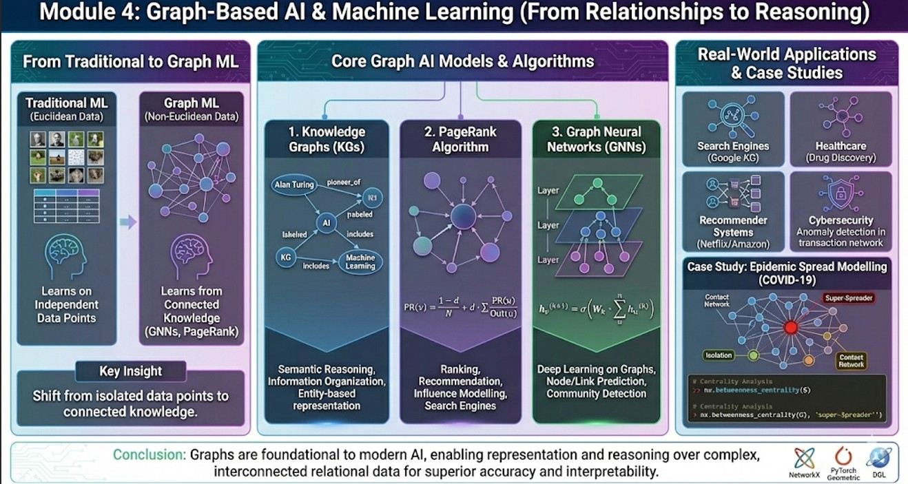

<div style="width: 100%; text-align: center;">
  
</div>

>Module outcomes:

Upon completion of this module, learners will be able to:

- Understand how graph structures naturally model relationships, dependencies, and interactions in real-world datasets.
- Explain the role of graph-based learning compared to traditional machine learning methods that assume IID (Independent & Identically Distributed) data.
- Describe and interpret major graph-based ML approaches such as *Graph Neural Networks (GNNs)*, *Graph Convolutional Networks (GCNs)*, and *Graph Attention Networks (GATs)*.
- Analyse the working principle of *PageRank* and its importance in ranking, recommendation, and influence modelling.
- Apply graph analytics to solve real-world problems such as community detection, recommendation systems, fraud detection, and biological network analysis.
- Implement basic graph-based ML tasks using Python libraries such as `NetworkX`, `PyTorch Geometric`, or `DGL`.
- Build small proof-of-concept models using publicly available graph datasets (e.g., Cora citation network, Karate club dataset).
- Understand research opportunities, scalability challenges, and future directions in graph-based machine learning.


## Introduction

Graphs play an increasingly critical role in modern *Artificial Intelligence and Machine Learning*, enabling representation and reasoning over structured data with complex relationships. Unlike traditional ML models that handle grid-structured or tabular data, graphs naturally encode *interconnected, relational and irregular structures*.

The development of Graph Neural Networks (GNNs), including Graph Convolutional Networks (GCNs) and Graph Attention Networks (GATs), has opened new avenues for learning from structured dependencies rather than treating data points as independent entities. These models have demonstrated breakthrough performance in tasks such as node classification, link prediction, community detection, recommendation systems, and risk intelligence.

Furthermore, real-world AI systems—such as Google’s ranking algorithms, fraud detection engines in banking, medical knowledge discovery systems, and smart city analytics—rely heavily on graph-based reasoning. As industry adoption accelerates, expertise in graph analytics and graph-based deep learning has become an essential skill for engineers, data scientists, and AI researchers.

Graph-based approaches thus represent a powerful paradigm shift:  *from learning on isolated data points to learning from connected knowledge.*  
Mastering graph theory and graph ML prepares learners to solve scalable real-world problems and engage in research opportunities at the intersection of mathematics, computation, and intelligent systems.

This module introduces core graph-based AI models and algorithms:
- *Knowledge Graphs (KGs)* for semantic reasoning and information organization
- *PageRank algorithm* for ranking & recommendation
- *Graph Neural Networks (GNNs)* for deep learning on graph-structured data

## Knowledge Graphs (KGs)

### What is a Knowledge Graph?

A *Knowledge Graph* is a labelled, directed graph used to represent knowledge in terms of *entities (nodes)* and *relationships (edges)*. A Knowledge Graph is a massive collection of `Subject-Predicate-Object` triples. This is the standard format for resource description (like RDF in the Semantic Web)

Example structure:

```bash
(Person) ---[lives_in]---> (City)
(Author) ---[wrote]------> (Book)
(Student) ---[enrolled]--> (Course)
Alan Turing) —[pioneer_of]→ (AI)
(AI) —[includes]→ (Machine Learning)
(ML) —[subset_of]→ (Deep Learning)
```

For example in the Alan-- Turing-- Pioneer_of -- AI:

- *Subject:* The node you are describing (e.g., "Alan Turing").

- *Predicate:* The specific relationship edge (e.g., "pioneer_of").

- *Object:* The target node or literal value (e.g., "Artificial Intelligence").

>**Why Triples Matter:** Triples standardize knowledge so machines can parse it without ambiguity. Instead of vague text like "Turing started AI," the triple (Alan Turing, pioneer_of, AI) is structured data.

:::{.callout-note}
### Key Characteristics
- **Entity-based representation**
- **Semantic relationship modelling**
- **Supports reasoning & inference**
:::

### How KGs Enable "Reasoning" (Inference)

The biggest advantage of a KG over a relational database is the ability to infer new knowledge that isn't explicitly stored.Example of Inference:Imagine your KG has these two facts:(Elon Musk, CEO_of, Tesla)(Tesla, located_in, Texas)A standard database only knows those two facts. A Knowledge Graph with reasoning rules can infer a third fact:Inferred Fact: (Elon Musk, works_in, Texas)This is done via transitive properties defined in the graph's schema (ontology). If $A \to B$ and $B \to C$, the system knows $A \to C$. This is crucial for AI assistants (like Siri or Google Assistant) to answer multi-hop questions.

### The Concept of Embeddings (Bridging KGs to Deep Learning)
How do you feed a node like "Alan Turing" into a Neural Network? You can't feed text.

We convert nodes into Knowledge Graph Embeddings (KGEs). These are dense vector representations (e.g., an array of 128 numbers) that capture the semantic meaning of the node based on its position in the graph. Nodes with similar roles end up closer together in vector space. Models like TransE or RotatE are used to learn these embeddings.


### Real Engineering Applications

| Domain | Application | Example |
|--------|------------|----------|
| Search Engines | query understanding | Google Knowledge Graph |
| Healthcare | disease–symptom inference | biomedical KG |
| NLP / ChatGPT | fact linking | entity embeddings |
| Recommender Systems | product–user graph | Amazon, Netflix |
| Academic Research | citation networks | DBLP, Scopus |

### Mini Example in Python (NetworkX)

```{python}
import networkx as nx
import matplotlib.pyplot as plt

KG = nx.DiGraph()
KG.add_edges_from([
    ("Alan Turing", "AI", {"relation": "pioneer_of"}),
    ("AI", "Machine Learning", {"relation": "includes"}),
    ("Machine Learning", "Deep Learning", {"relation": "subset_of"}),
])

pos = nx.spring_layout(KG)
nx.draw(KG, pos, with_labels=True, node_size=2500)
plt.show()
```

## PageRank Algorithm

### The "Revolution" Before the Algorithm
Before Google's PageRank (circa 1998), search engines primarily used keyword matching (e.g., AltaVista). If you searched for "car," they looked for pages where the word "car" appeared the most times. This was easily spammed.

Larry Page and Sergey Brin's insight was that the web structure itself was a voting system. A link from page A to page B is a "vote of confidence" from A to B.

### Intuition

PageRank assigns an "importance" score to each node based on the importance and number of incoming links. Think of a random surfer who follows outgoing links with probability d (damping factor, usually 0.85) and jumps to a random node with probability 1−d. Pages that are linked from many important pages get higher PageRank.

### Core formula

$$PR(v)=\frac{1-d}{N}+d\sum\limits_{u\in In(v)}\frac{PR(u)}{Out(u)}$$

where:

- $PR(v)$ is the PageRank of node $v$
- $d$ is the damping factor (typically $d = 0.85$)
- $N$ is the total number of nodes
- $In(v)$ represents nodes linking to $v$
- $Out(u)$ represents the number of outgoing links from $u$

This is solved iteratively (power iteration) until convergence.

>*Discussion:* The formula contains a crucial constant, $d$ (usually 0.85), called the damping factor.Why is it there?

It solves two major problems in graph traversal:

- *Spider Traps (Sinks):* Imagine a group of websites that link to each other but never link out to the rest of the web. Without $d$, the "random surfer" would get stuck inside that group forever, and their PageRank would accumulate infinitely.

- *Dead Ends:* Pages with no outgoing links.The term $\frac{1-d}{N}$ represents the "teleportation" probability. It means: "There is a 15% chance ($1-0.85$) that the surfer gets bored of following links and just types a random new URL into their browser." This ensures the surfer never gets stuck and every page has a baseline non-zero probability of being visited.

### How it's Calculated?- *Power Iteration:*

One should know that PageRank isn't calculated in one shot. It's an iterative process.

- *Initialization:* Every node starts with an equal PageRank score of $1/N$.
- *Iteration 1:* Every node passes its current score, divided by its outgoing links, to its neighbors.
- *Update:* Every node recalculates its new score based on what it received (using the formula).
- *Repeat:* Steps 2 and 3 are repeated. The scores will change drastically at first, but eventually, they "converge" (stop changing significantly). This stable state is the final PageRank.

### Example code

```{python}
import networkx as nx

G = nx.DiGraph()
edges = [('A','B'),('A','C'),('B','C'),('C','A'),('C','D'),('D','C')]
G.add_edges_from(edges)

pr = nx.pagerank(G, alpha=0.85)
print(pr)
```

>**Web demonstration**

```{python}
import networkx as nx
import matplotlib.pyplot as plt

# 1. Create a "Mini Internet"
web = nx.DiGraph()
edges = [
    ('Google', 'Wikipedia'), 
    ('Google', 'News'), 
    ('Wikipedia', 'Google'), 
    ('Wikipedia', 'News'), 
    ('Wikipedia', 'Blogs'),
    ('News', 'Blogs'), 
    ('Blogs', 'Google'), # The blog refers back to Google
    ('SpamSite', 'Google') # Spam trying to get attention
]
web.add_edges_from(edges)

# 2. Calculate PageRank
# alpha=0.85 is the "damping factor" (probability of continuing to click)
pagerank_scores = nx.pagerank(web, alpha=0.85)

# 3. Visualize
plt.figure(figsize=(10, 7))
pos = nx.spring_layout(web, seed=9)

# Node Size = Authority Score (Multiplied by 5000 for visibility)
node_sizes = [pagerank_scores[n] * 5000 for n in web.nodes()]

nx.draw_networkx_nodes(web, pos, node_size=node_sizes, node_color='skyblue', edgecolors='black')
nx.draw_networkx_edges(web, pos, arrowsize=20, edge_color='gray')
nx.draw_networkx_labels(web, pos, font_weight='bold')

plt.title("PageRank Visualization: Size = Authority/Influence")
plt.axis('off')
plt.show()

# 4. Show the Rankings
print("--- Search Engine Rankings ---")
# Sort by score
sorted_rank = sorted(pagerank_scores.items(), key=lambda x: x[1], reverse=True)
for rank, (node, score) in enumerate(sorted_rank, 1):
    print(f"#{rank}: {node} (Score: {score:.4f})")
```

:::{.callout-note}
### Uses / Applications
- Search engines: rank web pages.
- Recommendation: rank items or users in bipartite graphs.
- Citation analysis: identify influential papers/authors.
- Social networks: measure influence or authority.
- Spam/fraud detection: detect anomalous link patterns.

Resources :<https://shaoxiongji.github.io/knowledge-graphs/#knowledge-graphs>
 <https://github.com/totogo/awesome-knowledge-graph?tab=readme-ov-file#infrastructure>
:::

### Graph Neural Networks (GNNs)

Why can't we just use a standard Convolutional Neural Network (CNN), which works great on images?

- Images are Grids: An image pixel always has exactly 8 neighbors (up, down, left, right, diagonals). A CNN filter of size $3 \times 3$ always fits perfectly.
- Graphs are Irregular: In a social network, one person might have 5 friends, another might have 5,000. There is no fixed "grid." A standard CNN filter cannot slide over a graph.
- Permutation Invariance: In a graph, the order of nodes doesn't matter. If you reorder the adjacency matrix, it's still the same graph. Standard neural nets depend on a fixed input order.

:::{.callout-note}
Traditional ML models such as CNNs and RNNs assume Euclidean structure (images, sequences).
Graphs are non-Euclidean; therefore a new architecture is needed. GNNs solve this by being designed specifically for irregular neighbor structures.
:::

GNNs generalize neural networks to graph-structured data using message passing.

:::{.callout-note}
### Message Passing Update Rule

$$h_v(k+1)=\sigma\left(W_k\sum\limits_{u\in N(v)}h_u(k)\right)$$

where,

- $h_v^{(k)}$ is the representation of node $v$ after $k$ layers

- $N(v)$ represents neighbours

- $W_k$ is a learnable weight matrix

- $\sigma$ is an activation function

:::

Imagine Node $V$ trying to update its understanding of the world.

- Step 1: (Message Computation) Every neighbor ($u \in N(v)$) prepares a "message" to send to node $V$. This message is usually the neighbor's current features transformed by a learnable weight matrix.
   - Analogy: Your friends write down their opinions on a topic.

- Step 2: Aggregation (The Crucial Step) Node $V$ receives messages from all its neighbors. Since the number of neighbors varies, $V$ needs a way to combine them into a fixed-size representation.
  - Common Aggregators: Sum, Mean, or Max.
  - Analogy: You read all your friends' opinions and take the average opinion to summarize what your social circle thinks. 
  - Mathematically, this is the $\sum\limits_{u\in N(v)}$ part of the formula.

- Step 3: (Update) Node $V$ takes the aggregated neighborhood information and combines it with its own previous information to generate its new state.
   - Analogy: You combine your friends' average opinion with your own previous beliefs to form a new opinion.
   - Mathematically, this is the $\sigma(W_k \cdot [\text{aggregated\_info}])$ part.

### Major Variants: GCN vs. GAT

The two most famous variants differ in how they aggregate messages in Step 2.

>**Graph Convolutional Networks (GCN):**

- Mechanism: It takes a simple average (mean) of neighbor messages.

- Philosophy: "All my neighbors are equally important; I'll just take the consensus."

- Pros/Cons: Simple and fast, but sometimes over-smooths information.

>**Graph Attention Networks (GAT):**

- Mechanism: It uses an attention mechanism to learn which neighbors are more important. It computes a weighted average, where the weights are learned during training.

- Philosophy: "Neighbor A is an expert on this topic, so I'll listen to them twice as much as Neighbor B."

- Pros/Cons: More powerful and accurate, but computationally heavier.

### GNN usescases

| Domain                 | Example                                    |
| ---------------------- | ------------------------------------------ |
| Social Networks        | community detection, link prediction       |
| Chemistry / Biology    | drug discovery, molecular graph prediction |
| Traffic Forecasting    | congestion modelling                       |
| Cybersecurity          | anomaly detection                          |
| Finance                | fraud & risk modelling                     |
| Recommendation Systems | deep collaborative filtering               |

## The Karate Club Demo

This is a real dataset from the 1970s. A Karate instructor and an administrator got into a fight. The club split. Using just the graph structure—who talked to whom—our code can predict exactly which student joined which faction. This is how Facebook suggests friends. This is how Amazon suggests products. It’s not magic. It’s Graph Theory.

:::{.callout-note}

### What thus script do?

This script is designed to demonstrate Semi-Supervised Learning. Instead of just "coloring" the graph, we will simulate an AI problem:

- We "hide" the faction of everyone except the two leaders (Node 0 and Node 33).

- We use an algorithm (Label Propagation) to learn which side everyone else belongs to based purely on the connections.

This mimics how Graph Neural Networks work (using neighbors to predict node properties).

:::

>**The Script: AI Prediction on Zachary's Karate Club**

```{python}
import networkx as nx
import matplotlib.pyplot as plt
import matplotlib.colors as mcolors

# ==========================================
# STEP 1: LOAD THE DATASET
# ==========================================
# Zachary's Karate Club is a built-in dataset in NetworkX
G = nx.karate_club_graph()

# The dataset comes with the "club" attribute which tells us the TRUE faction
# 'Mr. Hi' (Node 0) vs 'Officer' (Node 33)
true_labels = [G.nodes[i]['club'] for i in G.nodes()]

print(f"Graph Loaded: {G.number_of_nodes()} Students, {G.number_of_edges()} Interactions.")

# ==========================================
# STEP 2: SIMULATE "MISSING DATA" FOR AI
# ==========================================
# We will hide the labels of all students except the two leaders.
# The AI must "guess" the rest.
known_labels = {}
for node in G.nodes():
    if node == 0:
        known_labels[node] = 'Mr. Hi'  # Leader 1
    elif node == 33:
        known_labels[node] = 'Officer' # Leader 2
    else:
        # We pretend we don't know which club these students joined
        continue 

# ==========================================
# STEP 3: THE "LEARNING" (Label Propagation)
# ==========================================
# This algorithm spreads the known labels to neighbors iteratively.
# It is a fundamental concept behind GNNs (Message Passing).
H = G.copy()
nx.set_node_attributes(H, known_labels, 'predicted_club')

# Use NetworkX's built-in Label Propagation (semi-supervised)
# Note: We use the community detection version here for demonstration
from networkx.algorithms import community

# Find communities purely based on structure
communities = community.greedy_modularity_communities(H)

# Map the results back to a dictionary
predicted_groups = {}
for i, comm in enumerate(communities):
    for node in comm:
        predicted_groups[node] = i

# ==========================================
# STEP 4: VISUALIZATION
# ==========================================
plt.figure(figsize=(12, 8))
pos = nx.spring_layout(G, seed=42) # Fixed layout for consistency

# Prepare colors based on the PREDICTED groups
node_colors = [predicted_groups[n] for n in G.nodes()]

# Draw the Nodes
# We use a cool-warm colormap to clearly show the two factions
nodes = nx.draw_networkx_nodes(G, pos, 
                               node_size=600, 
                               node_color=node_colors, 
                               cmap=plt.cm.coolwarm, 
                               edgecolors='black')

# Draw the Edges
nx.draw_networkx_edges(G, pos, alpha=0.3)

# Highlight the Leaders (The only data we "gave" the AI)
nx.draw_networkx_nodes(G, pos, nodelist=[0, 33], node_size=1000, node_color='gold', edgecolors='black', linewidths=2)
nx.draw_networkx_labels(G, pos, labels={0: "Mr. Hi", 33: "Officer"}, font_weight="bold", font_size=12)
nx.draw_networkx_labels(G, pos, font_color='white', font_size=8)


plt.title("AI Prediction of Karate Club Factions\n(Gold Nodes = Known Leaders, Red/Blue = Learned from Structure)", fontsize=14)
plt.axis('off')
plt.show()
# ==========================================
# STEP 5: EVALUATION
# ==========================================
# Let's see if the structure-based split matches reality
print("--- Prediction Analysis ---")
print(f"Algorithm identified {len(communities)} distinct communities.")
print("Note: In a perfect structural split, these match the two real-world factions.")
```

:::{.callout-tip}
### Playlist Recommendation!

This is exactly how Spotify predicts you will like a song because your 'graph neighbors' (people with similar taste) liked it.

:::

## Case Study — Epidemic Spread Modelling

During the outbreak of contagious diseases such as COVID-19, Influenza, or Nipah virus, rapid identification of individuals who play a critical role in spreading infection is essential for effective containment. Public health authorities model social interactions as graphs where nodes represent individuals and edges represent close contact events capable of transmitting disease. Given a simulated contact network of individuals in a community, determine:

1. Nodes with the highest risk of spreading infection (super-spreaders) using graph centrality metrics.

2. The minimal set of nodes to isolate or track for maximum reduction in infection propagation.

3. Visualise the network and highlight highly influential individuals.

:::{.callout-note}
The current case study calculates centrality. To fit this module better, link it to AI/ML concepts.

- **Current state (Analytics):** We used mathematical formulas (Betweenness Centrality) defined by humans to find super-spreaders.

- **The AI/ML Perspective (Future thought):** In a real-world scenario, "risk" isn't just about topology. It's also about node features (age, occupation, vaccination status). A GNN could take both the graph structure and the individual node features to learn a far more accurate prediction of who is likely to become a super-spreader, even perhaps identifying risky nodes that don't look central in a simple topology view.
:::


```{python}
import networkx as nx
import matplotlib.pyplot as plt

G = nx.barabasi_albert_graph(20, 2)
nx.draw(G, with_labels=True, node_size=900)
plt.show()

centrality = nx.betweenness_centrality(G)
print(sorted(centrality.items(), key=lambda x: x[1], reverse=True))
```

```{python}
import networkx as nx
import matplotlib.pyplot as plt
import matplotlib.colors as mcolors
import numpy as np

# 1. Generate a scale-free network (realistic for social networks)
# 50 nodes, each new node attaches to 2 existing nodes
G = nx.barabasi_albert_graph(50, 2, seed=42)

# Calculate layout once to ensure nodes and edges align perfectly
pos = nx.spring_layout(G, seed=42)

# 2. Calculate Betweenness Centrality
centrality = nx.betweenness_centrality(G)

# 3. Prepare visualization based on centrality scores
# Node size depends on centrality (scaled up for visibility)
# Add a small base size (e.g., +100) so nodes with 0 centrality don't disappear entirely
node_sizes = [(v * 10000) + 100 for v in centrality.values()]

# Node color gradient based on centrality
node_colors = list(centrality.values())

# Create plot structure
plt.figure(figsize=(10, 7))
# Get Current Axes - crucial for the fix later
ax = plt.gca()

# Draw Nodes
nodes = nx.draw_networkx_nodes(G, pos=pos,
                               node_size=node_sizes,
                               node_color=node_colors,
                               cmap=plt.cm.coolwarm, # Red-Blue color map
                               edgecolors='gray',
                               ax=ax)

# Draw Edges
nx.draw_networkx_edges(G, pos=pos, alpha=0.3, ax=ax)

# Create the ScalarMappable for the legend
vmin = min(node_colors)
vmax = max(node_colors)
# Ensure vmin and vmax are not identical to avoid division by zero in normalization if graph is tiny
if vmin == vmax:
      vmax += 0.0001

sm = plt.cm.ScalarMappable(cmap=plt.cm.coolwarm, norm=plt.Normalize(vmin=vmin, vmax=vmax))
sm.set_array([])

# Add a colorbar, explicitly telling it which axis (ax) to attach to
cbar = plt.colorbar(sm, ax=ax, label="Epidemic Risk (Betweenness Centrality)")
plt.title("Identifying Super-Spreaders via Graph Centrality", fontsize=14)
plt.axis('off')
plt.show()

# Print top 3 risky individuals
sorted_risk = sorted(centrality.items(), key=lambda x: x[1], reverse=True)
print("Top 3 Highest Risk Nodes (Super-Spreaders):")
for node, score in sorted_risk[:3]:
    print(f"Node ID: {node}, Risk Score: {score:.4f}")
```

## Conclusion

Graphs have emerged as a foundational component in modern Artificial Intelligence and Machine Learning, enabling representation and analysis of complex relational data that cannot be captured effectively through traditional vector-based approaches. By leveraging graph structures, algorithms can model interconnected systems such as social networks, transportation systems, biological interactions, and financial transaction workflows with superior accuracy and interpretability.


