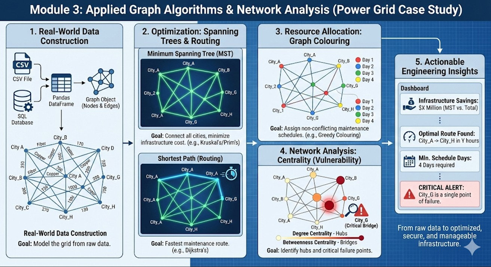

<div style="width: 100%; text-align: center;">
  
</div>


## Introduction

This module introduces practical graph modelling and algorithm execution using `Python` and the `NetworkX` library. Students will learn to construct real and simulated graphs, visualize structure, compute metrics, and explore algorithms such as *shortest paths, centrality, and colouring*.  

The objective is to bridge theoretical understanding from discrete mathematics to real-world implementations in engineering problems such as *network routing, urban mobility, scheduling, and social network analytics*.

## Learning Objectives

By the end of this module, students will be able to:

- **Construct** complex graphs directly from dataframes/datasets.
- **Apply** algorithms: Dijkstra (Routing), Kruskal/Prim (MST), and Greedy Colouring.
- **Analyse** network robustness using Degree and Betweenness centrality.
- **Perform** visual data-driven studies to interpret network structure.


## Constructing Graphs from Real-World Data

Real-world data rarely comes in neat adjacency matrices. In engineering and data science, network data usually exists in **CSV files**, **SQL databases**, or **Excel sheets**. 

To bridge this gap, we utilize data handling libraries (like Pandas) to load datasets representing entities (nodes) and connections (edges). For our case study, we simulate a dataset of **8 cities** and the **construction cost** (in millions) to build high-voltage lines between them. 

The graph is constructed by mapping:

- **Source/Target columns** $\rightarrow$ Edges
- **Cost/Type columns** $\rightarrow$ Edge Attributes (Weights)

```{python}
import networkx as nx
import pandas as pd
import matplotlib.pyplot as plt

# 1. Simulate a "Real-World" Dataset (e.g., imported from CSV)
data = {
    'Source': ['City_A', 'City_A', 'City_B', 'City_B', 'City_C', 'City_D', 'City_E', 'City_F', 'City_G'],
    'Target': ['City_B', 'City_C', 'City_D', 'City_E', 'City_F', 'City_E', 'City_G', 'City_G', 'City_H'],
    'Cost':   [10,       15,       12,       15,       10,       5,        8,        20,       12],  # Edge Weight
    'Type':   ['Fiber',  'Copper', 'Fiber',  'Copper', 'Fiber',  'Fiber',  'Copper', 'Fiber',  'Copper'] # Attribute
}

df = pd.DataFrame(data)

# 2. Construct the Graph directly from the DataFrame
# This is the industry-standard way to load graphs
G = nx.from_pandas_edgelist(df, source='Source', target='Target', edge_attr=['Cost', 'Type'])

print(f"Graph Successfully Constructed!")
print(f"Nodes (Cities): {G.number_of_nodes()}")
print(f"Edges (Power Lines): {G.number_of_edges()}")

# Quick Visualization
plt.figure(figsize=(10, 6))
pos = nx.spring_layout(G, seed=42)
nx.draw(G, pos, with_labels=True, node_color='lightgreen', node_size=1200, font_weight='bold')
nx.draw_networkx_edge_labels(G, pos, edge_labels=nx.get_edge_attributes(G, 'Cost'))
plt.title("Regional Power Grid Topology")
plt.show()
``` 

## Optimization Algorithms: Spanning Trees & Routing

Once the graph is built, we can apply standard optimization algorithms to save costs and improve efficiency.

### Minimum Spanning Tree (MST)

**The Scenario:** We need to connect *all* cities with power lines to ensure everyone has electricity, but we want to minimize the total construction cost. We do not need redundant loops; we just need basic connectivity.

**The Solution:** We apply **Kruskal’s or Prim’s Algorithm**.
This algorithm identifies a subset of edges that connects all vertices together, without any cycles, and with the minimum possible total edge weight. By comparing the total cost of the full network versus the MST, engineers can quantify potential infrastructure savings.

**Algorithm:** Kruskal’s or Prim’s Algorithm (implemented via minimum_spanning_tree).
```{python}
# Calculate the Minimum Spanning Tree
mst = nx.minimum_spanning_tree(G, weight='Cost')

# Calculate Total Savings
total_cost = df['Cost'].sum()
mst_cost = sum(d['Cost'] for u, v, d in mst.edges(data=True))

print(f"Total Network Cost: ${total_cost}M")
print(f"Optimized MST Cost: ${mst_cost}M")
print(f"Savings: ${total_cost - mst_cost}M")

# Visualizing the MST vs Original Graph
plt.figure(figsize=(10, 6))
# Draw original faint edges
nx.draw_networkx_edges(G, pos, alpha=0.2, style='dashed')
# Draw MST edges boldly
nx.draw(mst, pos, with_labels=True, node_color='gold', node_size=1200, width=3, edge_color='blue')
plt.title("Optimized Infrastructure (Minimum Spanning Tree)")
plt.show()
```

### Shortest Path (Routing)

**The Scenario:** A maintenance team needs to travel from `City_A` to `City_H` as quickly as possible to fix a fault.

**The Solution:** We apply **Dijkstra's Algorithm**.
Unlike the MST (which optimizes the *whole* network), Dijkstra focuses on the optimal route between *two specific points*. It accounts for the accumulated "cost" (distance, time, or money) along the path.

```{python}
# Compute Shortest Path
source, target = 'City_A', 'City_H'
path = nx.dijkstra_path(G, source, target, weight='Cost')
length = nx.dijkstra_path_length(G, source, target, weight='Cost')

print(f"Optimal Route from {source} to {target}: {path}")
print(f"Total Travel Cost: {length}")
```

## Resource Allocation: Graph Colouring

**The Scenario:** We need to assign maintenance schedules to these cities. Adjacent cities cannot be maintained on the same day because shutting down two connected nodes simultaneously might destabilize the grid. What is the minimum number of days required to complete the schedule?

**The Solution:** We apply **Greedy Graph Colouring**.

* **The Rule:** No two connected nodes can have the same "color" (value).
* **The Result:** The algorithm assigns a time slot to every city. The total number of unique colors used (the *Chromatic Number*) tells us the minimum days required for the full cycle.

**Algorithm:** Greedy Graph Colouring.

```{python}
# Apply Greedy Coloring
strategies = nx.coloring.greedy_color(G, strategy='largest_first')

print("--- Maintenance Schedule (Graph Colouring) ---")
for node, color in strategies.items():
    print(f"{node}: Day {color + 1}")

# Calculate Chromatic Number (Min days needed)
min_days = max(strategies.values()) + 1
print(f"\nMinimum days required for full cycle: {min_days}")

# Visualizing the Schedule
colors = [strategies[n] for n in G.nodes()]
plt.figure(figsize=(8, 5))
nx.draw(G, pos, node_color=colors, cmap=plt.cm.Set3, with_labels=True, node_size=1200)
plt.title(f"Conflict-Free Schedule (Requires {min_days} Days)")
plt.show()
```

## Network Analysis: Centrality Measures

**The Scenario:** We need to secure the network against attacks or random failures. We must answer two questions:
1.  Which city is the biggest "Hub"?
2.  Which city is the most critical "Bridge"?

**The Solution:** We calculate **Centrality Measures**.

* **Degree Centrality:** Measures how many direct connections a node has. In our grid, this identifies the central distribution hubs.
* **Betweenness Centrality:** Measures how often a node acts as a bridge along the shortest path between two other nodes. This identifies **Single Points of Failure**. If a node with high Betweenness fails, the network is likely to split into disconnected islands.

```{python}
# 1. Compute Centralities
degree_cent = nx.degree_centrality(G)
betweenness_cent = nx.betweenness_centrality(G, weight='Cost')

# 2. Advanced Visualization: Data-Driven Plotting
plt.figure(figsize=(12, 8))

# Get the current axes explicitly so we can refer to it later
ax = plt.gca()

# Size of node = Degree (How connected it is)
node_sizes = [v * 5000 for v in degree_cent.values()]

# Color of node = Betweenness (How critical it is)
node_colors = list(betweenness_cent.values())

# Draw the nodes
nodes = nx.draw_networkx_nodes(G, pos, node_size=node_sizes, node_color=node_colors, 
                               cmap=plt.cm.Reds, edgecolors='black', ax=ax)

# Draw edges and labels
nx.draw_networkx_edges(G, pos, width=1.5, alpha=0.6, ax=ax)
nx.draw_networkx_labels(G, pos, font_color='black', font_weight='bold', ax=ax)

# --- FIX START ---
# Create the ScalarMappable
vmin = min(node_colors)
vmax = max(node_colors)
sm = plt.cm.ScalarMappable(cmap=plt.cm.Reds, norm=plt.Normalize(vmin=vmin, vmax=vmax))
sm.set_array([]) 

# Pass the 'ax' argument so matplotlib knows where to put the bar
plt.colorbar(sm, ax=ax, label="Betweenness Centrality (Vulnerability)")
# --- FIX END ---

plt.title("Vulnerability Analysis: Bigger = More Connections, Redder = More Critical")
plt.axis('off')
plt.show()

# Interpretative Output
critical_node = max(betweenness_cent, key=betweenness_cent.get)
print(f"CRITICAL ALERT: {critical_node} controls the highest flow in the network.")
```

## Interpretative Study: Summary

By combining these algorithms, we can derive actionable engineering insights from raw data:

| Analysis Type | Metric/Algorithm | Engineering Insight from Data |
| :--- | :--- | :--- |
| **Connectivity** | Data Ingestion | The network structure reveals the physical density of the grid. |
| **Optimization** | MST | Identifies which power lines are essential and which are redundant "backup" lines. |
| **Scheduling** | Colouring | Determines the minimum resources (time slots, frequency channels) needed to avoid conflicts. |
| **Vulnerability** | Betweenness | Pinpoints the exact city that, if disabled, causes the maximum disruption to the grid. |